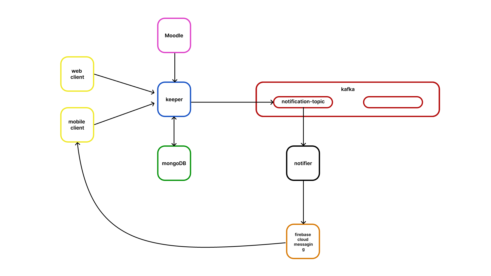

# aitu-keeper
A web application that processes data from Moodle, such as grades, deadlines, attendance, courses, and personal data. When data changes, such as grades, it saves the change in MongoDB and sends a message to Kafka for further notification to users' smartphones.

## Technologies
- [Rust](https://www.rust-lang.org/ru)
- [Apache Kafka](https://kafka.apache.org/)
- [MongoDB](https://www.mongodb.com/)
- [Firebase Cloud Messaging](https://firebase.google.com/docs/cloud-messaging?hl=ru)
- [Docker](https://www.docker.com/)

## System Architecture Diagram
  

## Developers
Contacts
- [Alexey Azarenkov](https://t.me/azarenkov_alexey) — Rust Developer
- [Evelina Penkova](https://t.me/etoevelina) - Mobile developer
